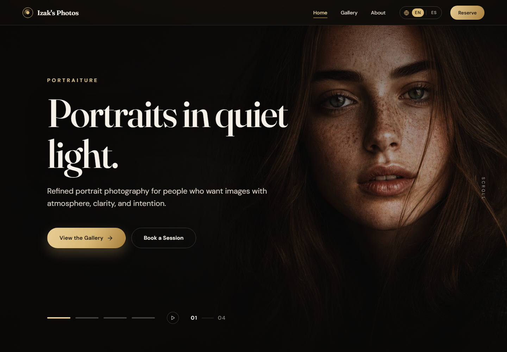
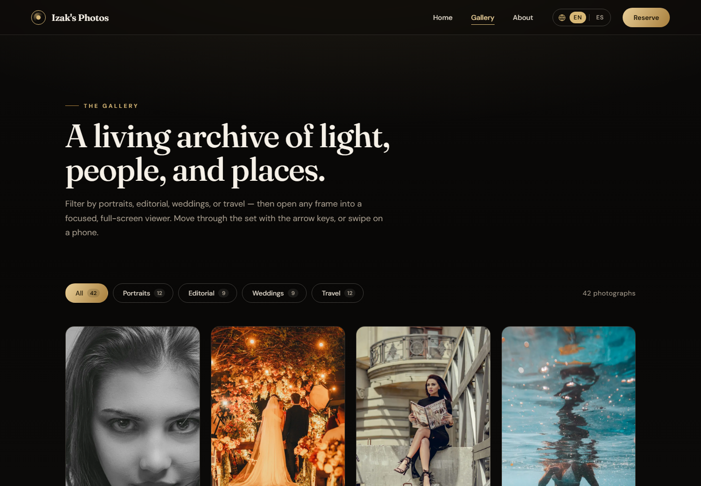
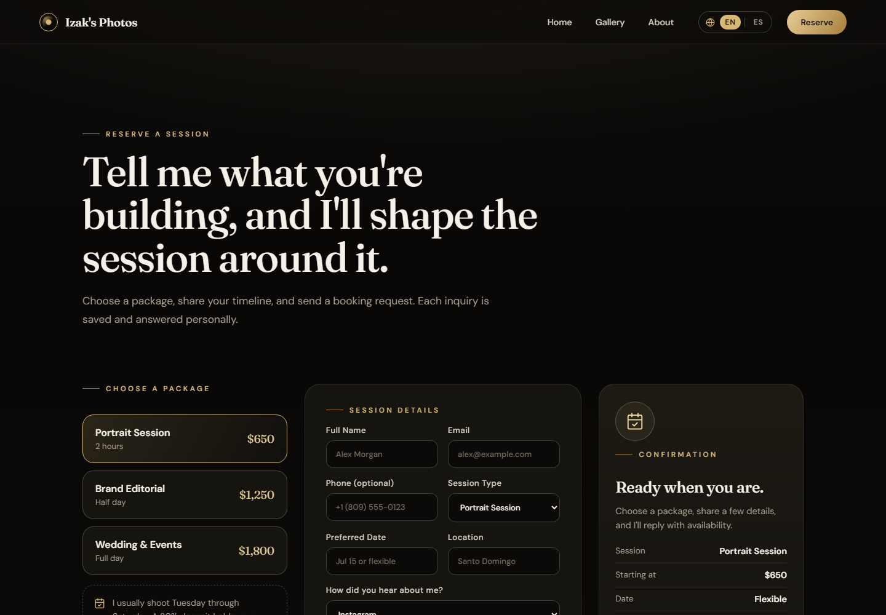
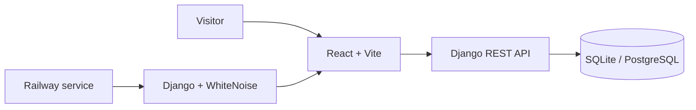

# Izak's Photos

### A bilingual photography portfolio with a Django API and a production React experience

[Live site](https://izaksphotos.jonasjavier.dev) · [Gallery](https://izaksphotos.jonasjavier.dev/projects) · [Reserve a session](https://izaksphotos.jonasjavier.dev/booking)



Izak's Photos is a full-stack portfolio for portrait, editorial, wedding, and travel photography. The product combines an image-led bilingual interface with a Django REST API for booking inquiries and a single-service Railway deployment.

## Product highlights

- Editorial homepage with a pausable hero slideshow and responsive desktop and mobile compositions
- Filterable gallery whose category and open photo live in the URL, so every frame has a shareable link
- Lightbox with keyboard, focus-trap, and swipe support, plus progressive loading from the grid preview
- English and Spanish interface with persistent language selection
- Booking workflow with packages, field-level validation, and API-backed inquiries
- Spam protection on the booking API: per-client rate limit and a honeypot field
- 720px WebP previews for grids (about 74% lighter than the full-size JPEGs) and production delivery through Django and WhiteNoise

## My role and collaboration

This repository is a fork of [JobNacor/IZAK-S-PHOTOS](https://github.com/JobNacor/IZAK-S-PHOTOS) and preserves attribution to the original collaboration.

Jonas Javier maintains this version and led its full-stack evolution: responsive React UI, bilingual product experience, Django REST integration, deployment preparation, testing, and technical documentation.

## Product surfaces

| Gallery | Booking workflow |
| --- | --- |
|  |  |

The screenshots above were captured from the production build at 1440 × 1000.

## Architecture



The Vite application is compiled for production and served by Django from the same Railway service. This keeps the public deployment single-origin while preserving an independent frontend development workflow.

## Technology

| Area | Stack |
| --- | --- |
| Backend | Python · Django · Django REST Framework |
| Frontend | React · Vite · React Router · JavaScript |
| Data | SQLite locally · PostgreSQL through `DATABASE_URL` |
| Delivery | Gunicorn · WhiteNoise · Railway · Nixpacks |
| Quality | Django tests · frontend production build · GitHub Actions |

## Project structure

```text
IZAK-S-PHOTOS/
├── backend/              # Django project and REST API
├── frontend/             # React/Vite application and optimized media
├── scripts/              # Local dev launcher and image preview generator
├── docs/screenshots/     # Production product evidence
├── .github/workflows/    # Automated backend and frontend checks
├── .env.example          # Safe configuration template
├── nixpacks.toml         # Railway build configuration
├── railway.toml          # Railway deployment configuration
└── package.json          # Root development commands
```

## Local development

Requirements: Python 3.11 or newer, Node.js 20 or newer, and npm.

```powershell
python -m venv .venv
.\.venv\Scripts\Activate.ps1
python -m pip install -r requirements.txt
npm ci --prefix frontend
Copy-Item .env.example .env
python scripts/dev.py
```

Local services:

- Frontend: `http://127.0.0.1:5173`
- Backend: `http://127.0.0.1:8000`
- API health check: `http://127.0.0.1:8000/api/health/`

## Configuration

| Variable | Purpose |
| --- | --- |
| `DJANGO_SECRET_KEY` | Django signing key; always replace outside local development |
| `DJANGO_DEBUG` | Enables or disables debug mode |
| `DJANGO_ALLOWED_HOSTS` | Comma-separated accepted hosts |
| `DJANGO_CORS_ALLOWED_ORIGINS` | Comma-separated frontend origins |
| `DATABASE_URL` | Optional PostgreSQL connection URL |
| `RAILWAY_PUBLIC_DOMAIN` | Domain supplied by Railway |
| `VITE_API_URL` | Frontend API base URL for split local development |
| `CONTACT_RATE_LIMIT` | Booking requests allowed per client (default `10/hour`) |

Real environment files are ignored. Only safe templates belong in Git.

## Photography assets

Full-size JPEGs live in `frontend/src/images/optimized/` and feed the hero and the lightbox. Grids and cards use 720px WebP previews in `frontend/src/images/thumbs/`. After adding or replacing a photo, regenerate the previews and the Open Graph image:

```powershell
python -m pip install pillow
python scripts/optimize_images.py
```

Then add the photo's entry (file name, size, category, and bilingual title) to `frontend/src/data/portfolio.js`.

## Quality checks

```powershell
python backend/manage.py test api
npm --prefix frontend run build
```

The same checks run automatically on pushes and pull requests through GitHub Actions.

## Deployment

The production configuration builds the Vite frontend, runs Django migrations and `collectstatic`, and starts Gunicorn. Secrets and database credentials must be configured in Railway rather than committed to the repository.

## License and media rights

The code is distributed under the repository's [GPL-3.0 license](LICENSE). Photography, model likenesses, and other visual assets may carry separate ownership or usage restrictions; the code license does not automatically grant permission to reuse those assets.
