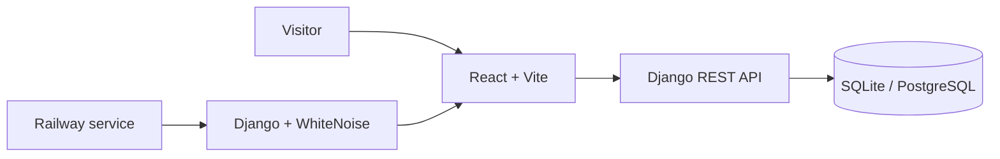

<div align="center">

# Izak's Photos

**A bilingual, editorial-style photography portfolio built with Django REST Framework and React.**

[](https://github.com/JonasJavier/IZAK-S-PHOTOS/actions/workflows/ci.yml)
[](https://izaksphotos.jonasjavier.dev)
[](LICENSE)

[](https://www.python.org/)
[](https://www.djangoproject.com/)
[](https://www.django-rest-framework.org/)
[](https://react.dev/)
[](https://vitejs.dev/)
[](https://nodejs.org/)

[View the live site](https://izaksphotos.jonasjavier.dev) · [Features](#-features) · [Tech Stack](#-tech-stack) · [Getting Started](#-getting-started) · [API](#-api-reference) · [Deployment](#-deployment)


</div>

## 🌐 Live Demo

The portfolio is deployed on Railway and publicly available at:

### 👉 https://izaksphotos.jonasjavier.dev

Browse the homepage, filter the gallery by category, open any photo in the lightbox, switch between English and Spanish, and send a booking request directly from the site.

## 📖 Overview

Izak's Photos is a full-stack portfolio concept for portrait, editorial, wedding, and travel photography. It combines an image-led bilingual React interface with a Django REST API for booking inquiries, deployed as a single Railway service.

The repository is organized as a monorepo so the API and the client can be installed and run together from the project root with a single command.

> **About the content.** Izak and the studio are fictional. Package prices, statistics, and testimonials are sample content used to demonstrate the product; they do not describe a real business. The production booking form validates and stores demo inquiries, so visitors should not submit sensitive or real booking information.

This repository is a maintained fork of [JobNacor/IZAK-S-PHOTOS](https://github.com/JobNacor/IZAK-S-PHOTOS) and preserves the original collaboration history. Jonas Javier maintains this production edition and led its full-stack evolution: the responsive React interface, bilingual experience, Django REST integration, Railway deployment, testing, performance work, and technical documentation.

## ✨ Features

| Area | Highlights |
| --- | --- |
| **Editorial homepage** | Pausable hero slideshow, featured work, services, and testimonials with responsive desktop and mobile compositions. |
| **Filterable gallery** | Filter by category (Portraits, Editorial, Weddings, Travel). The active category and open photo live in the URL, so every frame has a shareable link. |
| **Lightbox** | Keyboard navigation, focus trap, swipe support, and progressive loading from the grid preview. |
| **Bilingual interface** | English and Spanish with persistent language selection. |
| **Booking flow** | Package selection and a booking form wired to the Django REST contact endpoint with field-level validation. |
| **Spam protection** | Per-client rate limit and a honeypot field on the booking API. |
| **Client-side routing** | Clean URLs (`/`, `/projects`, `/about`, `/booking`) with scroll-to-top and a dedicated not-found page. |
| **Performance** | 720px WebP previews for grids (about 74% lighter than the full-size JPEGs) and production delivery through Django and WhiteNoise. |
| **Developer experience** | One-command launcher that starts Django and Vite together and shuts both down on Ctrl+C. |

### Product surfaces

| Gallery | Booking workflow |
| --- | --- |
|  |  |

The screenshots above were captured from the production build at 1440 × 1000.

## 🏗 Architecture



The Vite application is compiled for production and served by Django from the same Railway service. This keeps the public deployment single-origin while preserving an independent frontend development workflow.

## 🛠 Tech Stack

### Backend

| Technology | Purpose |
| --- | --- |
| Django 5 | Web framework, admin, and SPA fallback route |
| Django REST Framework | JSON API endpoints and request throttling |
| django-cors-headers | Cross-origin access for the Vite dev server |
| dj-database-url | PostgreSQL configuration through `DATABASE_URL` |
| WhiteNoise | Serves the compiled frontend and static assets in production |
| Gunicorn | Production WSGI server |
| python-dotenv | Environment-based configuration |
| SQLite / PostgreSQL | Zero-config local database / persistent production database |

### Frontend

| Technology | Purpose |
| --- | --- |
| React 18 | UI component library |
| Vite 8 | Dev server and production bundler |
| React Router 7 | Client-side routing |
| Lucide React | Icon set |
| Custom CSS | Editorial design system and responsive layouts |

### Delivery and quality

| Area | Tooling |
| --- | --- |
| Hosting | Railway (Railpack builder), configured in `railway.toml` |
| Checks | Django tests, migration check, frontend production build |
| Automation | GitHub Actions on every push to `main` and every pull request |

## 🗂 Project Structure

```text
IZAK-S-PHOTOS/
├── backend/                  # Django project
│   ├── api/                  # REST API app (views, serializers, models, tests)
│   ├── backend/              # Settings, root URL config, ASGI/WSGI entry points
│   └── manage.py
├── frontend/                 # React + Vite client
│   ├── public/               # Static assets served as-is
│   └── src/
│       ├── components/       # Reusable UI components (Navbar, Hero, Gallery, BookingForm, ...)
│       ├── pages/            # Route-level pages (Home, Projects, About, Booking, NotFound)
│       ├── data/             # Portfolio entries and bilingual copy
│       ├── images/           # Full-size JPEGs and generated WebP previews
│       └── App.jsx           # Router and application shell
├── scripts/
│   ├── dev.py                # Unified launcher for backend + frontend
│   └── optimize_images.py    # Generates WebP previews and the Open Graph image
├── docs/
│   ├── DEPLOYMENT.md         # Railway deployment guide
│   └── screenshots/          # Production product evidence
├── .github/workflows/        # CI: backend tests and frontend build
├── .env.example              # Backend environment template
├── railway.toml              # Railway build, deploy, and healthcheck configuration
├── requirements.txt          # Python dependencies
├── package.json              # Root convenience scripts
├── CONTRIBUTING.md           # Development workflow and pull-request checklist
├── SECURITY.md               # Vulnerability reporting and secret handling
└── LICENSE                   # GPL-3.0
```

## 🚀 Getting Started

### Prerequisites

- Python 3.11 or newer
- Node.js 20 or newer (with npm)
- Git

### 1. Clone the repository

```bash
git clone https://github.com/JonasJavier/IZAK-S-PHOTOS.git
cd IZAK-S-PHOTOS
```

### 2. Set up the backend

<details open>
<summary><strong>Windows (PowerShell)</strong></summary>

```powershell
python -m venv .venv
.\.venv\Scripts\Activate.ps1
python -m pip install --upgrade pip
python -m pip install -r requirements.txt
```

</details>

<details>
<summary><strong>macOS / Linux</strong></summary>

```bash
python3 -m venv .venv
source .venv/bin/activate
python -m pip install --upgrade pip
python -m pip install -r requirements.txt
```

</details>

### 3. Set up the frontend

```bash
npm ci --prefix frontend
```

### 4. Configure environment variables

Copy the templates. The backend template enables debug mode for local development; the frontend template is only needed when you run Vite against a separately hosted API.

```bash
cp .env.example .env
cp frontend/.env.example frontend/.env   # optional
```

On Windows PowerShell use `Copy-Item` instead of `cp`. See [Environment Variables](#%EF%B8%8F-environment-variables) for the full list.

### 5. Run database migrations

```bash
python backend/manage.py migrate
```

### 6. Start the development servers

Start Django and Vite together from a single terminal:

```bash
npm run dev
# or, equivalently
python scripts/dev.py
```

| Service | URL |
| --- | --- |
| Frontend | http://127.0.0.1:5173 |
| Backend | http://127.0.0.1:8000 |
| API health check | http://127.0.0.1:8000/api/health/ |

Press `Ctrl+C` to stop both services.

## 📜 Available Scripts

Run these from the repository root.

| Command | Description |
| --- | --- |
| `npm run dev` | Start backend and frontend together |
| `npm run backend` | Start only the Django server on port 8000 |
| `npm run frontend` | Start only the Vite dev server on port 5173 |
| `npm run test:backend` | Run the Django test suite |
| `npm run build:frontend` | Create a production build in `frontend/dist/` |
| `npm --prefix frontend run preview` | Preview the production build locally on port 4173 |

## 🔌 API Reference

All endpoints are served under `/api/` and return JSON. Every other path is handled by the React application.

| Method | Endpoint | Description |
| --- | --- | --- |
| `GET` | `/api/health/` | Service health check, also used by the Railway healthcheck |
| `POST` | `/api/contact/` | Validate, rate-limit, and persist a booking inquiry |

### Example: submit a booking inquiry

```bash
curl -X POST http://127.0.0.1:8000/api/contact/ \
  -H "Content-Type: application/json" \
  -d '{
    "name": "Jane Doe",
    "email": "jane@example.com",
    "projectType": "Portrait Session",
    "date": "Flexible",
    "location": "Santo Domingo",
    "message": "I would like to book a session next month."
  }'
```

**Success (201 Created)**

```json
{
  "status": "received",
  "message": "Your booking request has been received. I'll reply with availability shortly.",
  "id": 1,
  "inquiry": { "id": 1, "name": "Jane Doe", "email": "jane@example.com", "...": "..." }
}
```

**Validation error (400 Bad Request)**

```json
{
  "status": "error",
  "message": "Please review the highlighted fields.",
  "errors": { "email": ["This field is required."] }
}
```

`name`, `email`, and `message` are required. `phone`, `projectType`, `date`, `location`, and `referral` are optional. Requests beyond the per-client limit receive `429 Too Many Requests`, and submissions that fill the hidden `website` honeypot field are acknowledged but never stored.

## ⚙️ Environment Variables

| Variable | File | Default | Description |
| --- | --- | --- | --- |
| `DJANGO_SECRET_KEY` | `.env` | development-only key when debug is on | Django signing key. Production refuses to start unless it is a unique value of 50+ characters. |
| `DJANGO_DEBUG` | `.env` | `false` | Enables Django debug mode. The local template sets it to `true`; keep it `false` in production. |
| `DJANGO_ALLOWED_HOSTS` | `.env` | `localhost,127.0.0.1` | Comma-separated list of accepted hostnames |
| `DJANGO_CORS_ALLOWED_ORIGINS` | `.env` | `http://localhost:5173,http://127.0.0.1:5173` | Comma-separated frontend origins allowed to call the API |
| `DATABASE_URL` | `.env` | empty (SQLite) | PostgreSQL connection URL. Required in production so inquiries persist. |
| `RAILWAY_PUBLIC_DOMAIN` | Railway | empty | Domain supplied by Railway; added to the allowed hosts automatically |
| `CONTACT_RATE_LIMIT` | `.env` | `10/hour` | Booking requests allowed per client |
| `VITE_API_URL` | `frontend/.env` | `http://127.0.0.1:8000/api` | API base URL used by the frontend during split local development |

> **Note:** Never commit real secrets. `.env` files are ignored by Git at every level of the tree; only the `.env.example` templates belong in the repository.

## 🖼 Photography Assets

Full-size JPEGs live in `frontend/src/images/optimized/` and feed the hero and the lightbox. Grids and cards use 720px WebP previews in `frontend/src/images/thumbs/`. After adding or replacing a photo, regenerate the previews and the Open Graph image:

```bash
python -m pip install pillow
python scripts/optimize_images.py
```

Then add the photo's entry (file name, size, category, and bilingual title) to `frontend/src/data/portfolio.js`.

## 🧪 Testing

The backend ships with an API test suite covering the health check, inquiry persistence, field validation, the honeypot, and rate limiting.

```bash
python backend/manage.py test api
npm --prefix frontend run build
```

The same checks, plus a migration consistency check, run automatically on pushes and pull requests through GitHub Actions.

## 📦 Deployment

The production configuration in `railway.toml` builds the Vite frontend, runs Django migrations and `collectstatic`, and starts Gunicorn behind the `/api/health/` healthcheck. See the [Railway deployment guide](docs/DEPLOYMENT.md) for the complete setup, verification, rollback, and troubleshooting checklist.

Two variables must exist in the Railway service before deploying:

- `DJANGO_SECRET_KEY`: a unique key of at least 50 characters. Django refuses to start in production with a missing, short, or placeholder key.
- `DATABASE_URL`: attach a Railway PostgreSQL database and reference its URL. Without it Django falls back to SQLite on the container's disk, which is wiped on every deploy, so booking inquiries would be lost.

Secrets and database credentials belong in Railway, never in the repository.

## 📚 Documentation

| Guide | What it covers |
| --- | --- |
| [Deployment](docs/DEPLOYMENT.md) | Railway setup, environment variables, verification, rollback, and troubleshooting |
| [Contributing](CONTRIBUTING.md) | Development workflow, conventions, and the pull-request checklist |
| [Security](SECURITY.md) | Supported code, private vulnerability reporting, and secret handling |
| [License](LICENSE) | GPL-3.0 terms for the source code |

## 🤝 Contributing

Contributions, issues, and feature requests are welcome.

1. Fork the repository
2. Create a feature branch: `git checkout -b feature/my-improvement`
3. Commit your changes with a clear message
4. Push the branch and open a Pull Request

Please run the backend tests and make sure the frontend builds before submitting. See [CONTRIBUTING.md](CONTRIBUTING.md) for the full checklist.

## 📄 License and Media Rights

The code is distributed under the **GNU General Public License v3.0**. See the [LICENSE](LICENSE) file for details.

Photography, model likenesses, and other visual assets may carry separate ownership or usage restrictions; the code license does not automatically grant permission to reuse those assets.

## 👥 Authors

- **Job Nacor** · [@JobNacor](https://github.com/JobNacor)
- **Jonas Javier Encarnación** · [@JonasJavier](https://github.com/JonasJavier)

<div align="center">

### 🌐 Visit [izaksphotos.jonasjavier.dev](https://izaksphotos.jonasjavier.dev)

If you like this project, consider giving it a ⭐ on GitHub.

</div>
