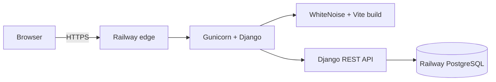

# Railway deployment guide

This project deploys the React/Vite frontend and Django API as one Railway service, with a separate Railway PostgreSQL service for persistent booking inquiries.

## Production topology



The web service deploys from the repository's `main` branch. Railway reads `railway.toml` from the repository root.

## Required services and variables

Create a Railway project with:

1. A GitHub-backed service for this repository.
2. A PostgreSQL service connected to the web service.
3. A custom domain, or a generated Railway domain, for the web service.

Configure these service variables without exposing their values in commits, issues, screenshots, or logs:

| Variable | Required value |
| --- | --- |
| `DJANGO_SECRET_KEY` | Unique random value with at least 50 characters |
| `DJANGO_DEBUG` | `false` |
| `DATABASE_URL` | Reference to the PostgreSQL service URL |
| `DJANGO_ALLOWED_HOSTS` | Comma-separated public hosts; do not include schemes |
| `DJANGO_CORS_ALLOWED_ORIGINS` | Comma-separated HTTPS origins |
| `RAILWAY_PUBLIC_DOMAIN` | Supplied automatically by Railway when a public domain exists |
| `CONTACT_RATE_LIMIT` | Optional DRF rate, for example `10/hour` |

Generate a Django key locally with:

```powershell
python -c "from django.core.management.utils import get_random_secret_key; print(get_random_secret_key())"
```

Store the result only in Railway. Production intentionally refuses to start with a missing, short, or `django-insecure` key.

## Build and release lifecycle

Railway executes the commands declared in `railway.toml`:

1. Install Python dependencies.
2. Install the locked frontend dependencies with `npm ci`.
3. Build the Vite application.
4. Collect Django static files.
5. Run database migrations as the pre-deploy command.
6. Start Gunicorn on Railway's `$PORT`.
7. Probe `/api/health/` before promoting the deployment.

The healthcheck must return:

```json
{"status":"ok","service":"izaks-photos-api"}
```

## Pre-deploy checklist

Run the same critical checks locally before merging to `main`:

```powershell
$env:DJANGO_SECRET_KEY = "local-test-only-0123456789abcdefghijklmnopqrstuvwxyz-ABCDEFG"
$env:DJANGO_DEBUG = "false"
python backend/manage.py test api
npm ci --prefix frontend
npm --prefix frontend run build
```

Confirm that:

- The working tree contains no secrets or local database files.
- Import paths match file-name casing exactly; Railway builds on Linux.
- New Django model changes include migrations.
- The production build loads `/`, `/projects`, `/booking`, and `/about` directly.
- The GitHub Actions workflow is green.

## Production verification

After Railway reports a successful deployment, verify both the UI and the API:

```powershell
Invoke-WebRequest https://izaksphotos.jonasjavier.dev/ -UseBasicParsing
Invoke-RestMethod https://izaksphotos.jonasjavier.dev/api/health/
```

Then check the browser at desktop and mobile widths, including a direct gallery URL and the booking form's client-side validation. Do not submit real personal information to this demonstration project.

## Troubleshooting

### Vite reports `UNRESOLVED_IMPORT`

Check capitalization first. Windows resolves `Footer` and `footer` as the same path, but Railway's Linux builder does not. Rename the file and import so their casing is identical, commit the rename, and run the frontend build again.

### Django refuses to boot

Read the first configuration exception in the deploy logs. The most common cause is a missing or invalid `DJANGO_SECRET_KEY`. Never work around this guard by adding a fallback production secret to the repository.

### Healthcheck fails while the build succeeds

Open the deployment logs and confirm that Gunicorn bound to `0.0.0.0:$PORT`. Check migrations, `DJANGO_ALLOWED_HOSTS`, the database reference, and `/api/health/` before increasing the healthcheck timeout. Django intentionally leaves `SECURE_SSL_REDIRECT` off because Railway's edge terminates HTTPS and the internal healthcheck uses HTTP; production responses still set secure cookies, security headers, and HSTS.

### Static assets return 404

Confirm that the Vite build completed, `collectstatic` ran, and `frontend/dist` existed during collection. The production Vite base is `/static/`, and WhiteNoise serves the collected files.

## Rollback

If a new deployment is unhealthy, keep the last known-good deployment active and use Railway's deployment history to redeploy that version. Fix the issue in a new commit; do not edit generated build artifacts or commit credentials as an emergency workaround.
